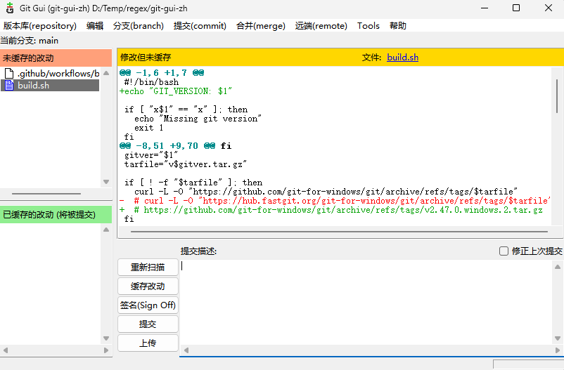

# Git for Windows 汉化

## Change log
2024-11-17 新增通过 Actions 编译<br>
......

### 在线编译
- Fork 本仓库
- Settings -> Secrets and variables -> Actions 添加一个变量 `GIT_VERSION` 并指定版本号，如：`2.48.1.windows.1`。
- 手动执行 Actions，然后下载生成的压缩包，把里面的东西（mingw64）解压到 Git 安装目录即可。

<hr>

### 本地编译

以下步骤是原文作者写的步骤 [@toyobayashi](https://github.com/toyobayashi/git-zh)

在 WSL 或 git bash 中

```bash
# ./build.sh <Git for windows 版本号>
./build.sh 2.31.0.windows.1
```

生成 `build-2.31.0.windows.1.zip`，把里面的东西解压到 Git 安装目录即可汉化。

如果获取不了源码，就把 `build.sh` 里的下载地址行头的井号 `#` 换一下位置

``` bash
curl -L -O "https://github.com/git-for-windows/git/archive/refs/tags/$tarfile"
# curl -L -O "https://hub.fastgit.org/git-for-windows/git/archive/refs/tags/$tarfile"
```

改为

``` bash
# curl -L -O "https://github.com/git-for-windows/git/archive/refs/tags/$tarfile"
curl -L -O "https://hub.fastgit.org/git-for-windows/git/archive/refs/tags/$tarfile"
```

## 移除汉化

去 Git 安装目录中删除这三个文件

```
/mingw64/share/locale/zh_CN/LC_MESSAGES/git.mo
/mingw64/share/git-gui/lib/msgs/zh_cn.msg
/mingw64/share/gitk/lib/msgs/zh_cn.msg
```

## 汉化预览


